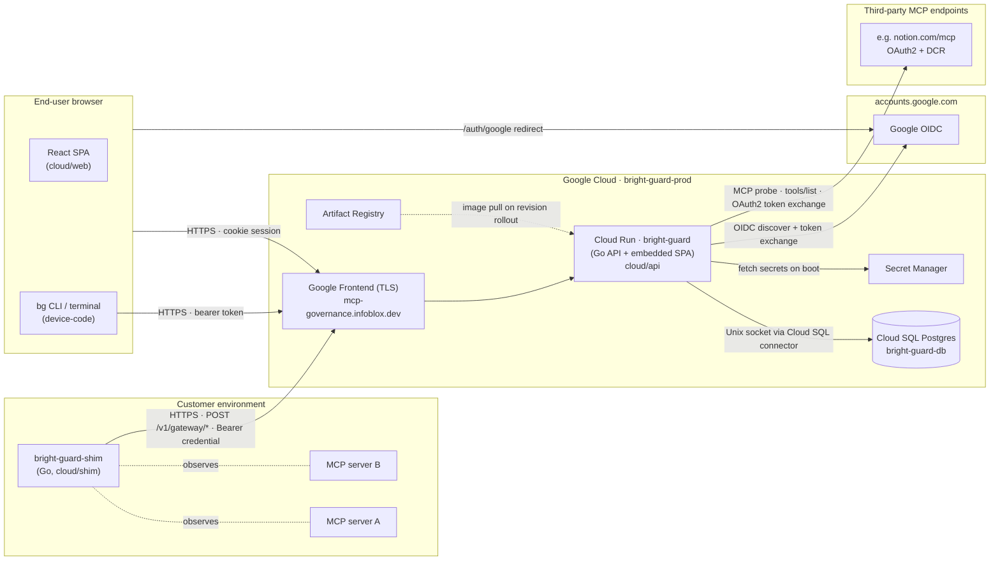

# System Overview

## What it is

Bright Guard is a single Go control-plane binary plus a small Go *shim* that customers deploy near their MCP servers. The control plane is multi-tenant (org-scoped), the shim is single-tenant (one credential, one org). The shim is the only data plane: it owns the customer-side observation pipeline and, since Wave N+5, the local CEL policy evaluator.

The control plane API, the React SPA, and the embedded `/docs` site are all served by the same binary; the SPA is baked into the binary by the Dockerfile multi-stage build (`cloud/Dockerfile:7-23`). There is one Cloud Run service in production (`bright-guard`) plus a long-running demo shim (`bright-guard-shim-demo`) that heartbeats fake traffic against the prod control plane.

## Component diagram

## What runs where

| Component | Location | Source |
|---|---|---|
| Control plane API | Cloud Run service `bright-guard`, region `us-central1`, port 8080 | `cloud/api/cmd/api/main.go` |
| Embedded SPA | Baked into the API binary via `go:embed` of `cloud/api/internal/spa/dist/` | `cloud/api/internal/spa/spa.go` |
| Database | Cloud SQL Postgres instance `bright-guard-db`, attached via Cloud SQL connector | `cloud/api/internal/db/db.go` |
| Customer shim | Customer-managed container (docker / k8s); production image `bright-guard-shim:latest` in Artifact Registry | `cloud/shim/cmd/shim/main.go` |
| Demo shim | Cloud Run service `bright-guard-shim-demo`, `min-instances=1`, fake traffic every 30s | `cloud/shim/examples/fake-servers.yaml` |
| Migrations | Applied at process start by goose using `embed.FS` | `cloud/api/internal/db/migrate.go` |
| Schedulers | Four (soon five) goroutines launched by `main.go`; coordinated via Postgres advisory locks | `cloud/api/cmd/api/main.go:99-120` |

## Traffic shapes

- **Browser → control plane.** Session cookie (`bg_session`), HTTPS-only, lax SameSite. Serves both `/api/*` and the SPA via the same router (`cloud/api/internal/api/server.go:197-199`).
- **CLI / terminal → control plane.** OAuth2 device-code flow yields a Bearer of the form `bg_cli_<uuid>.<secret>` (`cloud/api/internal/auth/session.go:19`). Bearer auth is honored on every `/api/*` route the cookie is.
- **Shim → control plane.** Three POST endpoints under `/v1/gateway/*`. `register` accepts an enrollment token in the body and exchanges it for a long-lived credential; `heartbeat` and `observations` use that credential as a Bearer (`cloud/api/internal/api/server.go:188-193`).
- **Control plane → third-party MCP.** Outbound only, during discovery sweeps. Supports api-key, bearer, basic, and OAuth2 authcode (with PKCE + DCR) auth methods (`cloud/api/internal/db/migrations/00004_mcp_connections.sql:7-12`).

## Two non-obvious shapes

- **The SPA is a child of the API.** No separate origin, no CDN. `SERVE_SPA=true` mounts `cloud/api/internal/spa.Handler()` as a chi catch-all (`cloud/api/internal/api/server.go:197`). This collapses the deploy model to one image, one Cloud Run revision, one URL — but couples the bundle's freshness to API releases.
- **Shim is the only data plane.** Invocation rows do not arrive from any browser path. They are exclusively inserted by `handleGatewayObservations` (`cloud/api/internal/api/phase2.go:417`), invoked over the shim credential.
