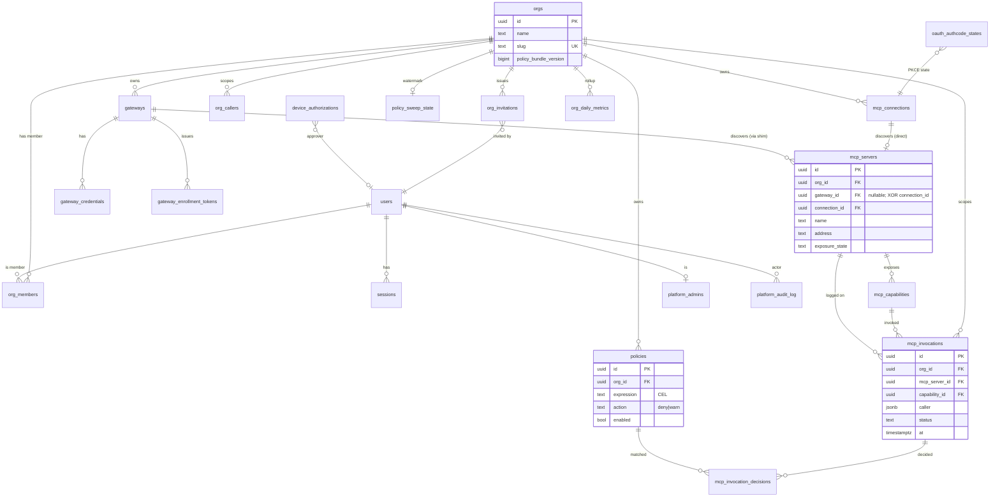

# Data Model

Postgres 15+ on Cloud SQL. Schema is applied at process boot by goose using the `embed.FS` at `cloud/api/internal/db/migrations/`. There is one database, one schema (`public`), one tenant table (`orgs`); every tenant-scoped row carries an `org_id` and has ON DELETE CASCADE from `orgs`.

## Migrations

| # | File | Adds |
|---|---|---|
| 00001 | `00001_init.sql` | `users`, `orgs`, `org_members`, `sessions`, `org_role` enum |
| 00002 | `00002_phase2.sql` | `gateways`, `gateway_credentials`, `gateway_enrollment_tokens`, `mcp_servers`, `mcp_capabilities`, `mcp_invocations` |
| 00003 | `00003_device_auth.sql` | `device_authorizations`; widens `sessions` with `kind`, `label`, `token_hash` for CLI sessions |
| 00004 | `00004_mcp_connections.sql` | `mcp_connections` (direct, gateway-less MCP discovery); `mcp_servers.gateway_id` becomes nullable, gains `connection_id`; XOR check constraint |
| 00006 | `00006_enrollment_claim_on_heartbeat.sql` | Two-phase enrollment-token claim (commit-on-first-heartbeat) |
| 00007 | `00007_oauth_authcode.sql` | `oauth_authcode_states` (PKCE), `mcp_connections.oauth_status` |
| 00008 | `00008_exposure_state.sql` | `mcp_servers.exposure_state`, `_reason`, `_classified_at` |
| 00009 | `00009_org_callers.sql` | `org_callers` (canonical-signature dedup, NEW-flag) |
| 00010 | `00010_capability_enabled.sql` | `mcp_capabilities.enabled`, `disabled_at`, `disabled_by` |
| 00011 | `00011_org_invitations.sql` | `org_invitations` (email invites, pending-dedup partial index) |
| 00012 | `00012_platform_admin.sql` | `platform_admins`, `platform_audit_log`; suspension columns on `users` and `orgs` |
| 00013 | `00013_policies.sql` | `policies`, `mcp_invocation_decisions`, `policy_sweep_state` |
| 00014 | `00014_policy_bundle_version.sql` | `orgs.policy_bundle_version` + trigger that bumps it on any `policies` mutation |
| 00015 | `00015_daily_metrics.sql` | `org_daily_metrics` rollup. **In flight in the current wave** — the migration file exists but the backend rollup pipeline is being landed by a parallel agent. |

Migration 00005 is intentionally absent (number was reserved for a change that didn't ship). Goose tolerates the gap.

## ERD

## Key tables · what each row means

- **`orgs`** — one row per tenant. Owns everything else by `org_id`. `policy_bundle_version` is bumped by a trigger on any `policies` mutation (`cloud/api/internal/db/migrations/00014_policy_bundle_version.sql:5-16`); the shim sends this as `X-Bundle-Version` so the server can skip the bundle payload when the shim is current.
- **`sessions`** — used for both browser cookie sessions and CLI bearer sessions. The `kind` column distinguishes them; `token_hash` is set only for CLI rows. A cookie cannot impersonate a CLI session, and vice versa (`cloud/api/internal/auth/session.go:117-120`).
- **`gateways`** + **`gateway_credentials`** + **`gateway_enrollment_tokens`** — one gateway per customer "site"; credentials are hashed (`secret_hash bytea`); enrollment tokens are single-use, claimed on `/v1/gateway/register`, and committed on first heartbeat (Wave N+1 fix — prevents orphan gateways if the shim crashes between claim and persist).
- **`mcp_servers`** — exactly one source per row (`gateway_id` XOR `connection_id`). Enforced by check constraint at `cloud/api/internal/db/migrations/00004_mcp_connections.sql:28-29`.
- **`mcp_invocations`** — the append-only audit log. Inserted exclusively by `handleGatewayObservations` (and the seed CLI). `caller` is `jsonb`; CEL policies dot-index into it.
- **`mcp_invocation_decisions`** — `(invocation_id, policy_id)` rows. Inserted by the shim if it has a live bundle, or by the policy sweep otherwise. Presence of a decision row for a given invocation is the marker the sweep uses to skip already-evaluated rows (`cloud/api/internal/api/phase2.go:462-470`).
- **`org_callers`** — canonical-signature dedup of `mcp_invocations.caller`. Maintained by the `bg-callers` sweep.
- **`oauth_authcode_states`** — ephemeral PKCE state. Lifetime is minutes.

## Indexing notes

- `mcp_invocations` is indexed `(org_id, at desc)` and `(mcp_server_id, at desc)`. Activity queries page by `at` descending with cursor pagination.
- `mcp_servers_exposure_idx` is a partial index on `(org_id, exposure_state) where exposure_state in ('public','unknown')` — keeps the exposure-sweep candidate set small.
- `org_invitations_pending_unique` is a partial unique index keyed on `(org_id, lower(email)) where status = 'pending'`. Two pending invites for the same email/org are impossible.

## What is not yet modeled

- No partitioning on `mcp_invocations`. Retention/partitioning is in the operating-plan as a Phase-2 enterprise-hardening item. Today this is a single growing table.
- No table for "policy versions" — `policies` has no history. Versioning is on the operating-plan roadmap.
- No table for asset/user identity (UC6 not started).
- No DNS-passive discovery telemetry (UC1 vision pillar not yet shipped — see [12-tradeoffs-and-roadmap.md](./12-tradeoffs-and-roadmap.md)).
