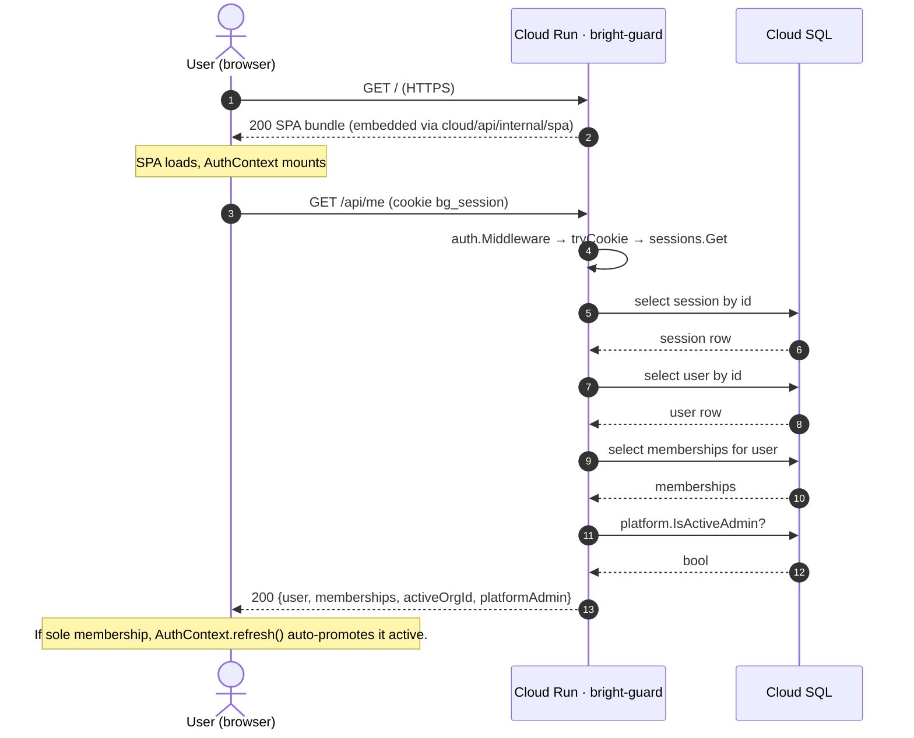

# Request Flows

The four flows below cover most of what the system does. Source files are cited inline.

## 1. Browser → SPA → `/api/me`

Initial bootstrap when a signed-in user opens the app.



Source: `cloud/api/internal/auth/session.go:82-126`, `cloud/api/internal/api/server.go:235-262`.

## 2. Gateway enrollment → observations

How a fresh shim becomes authorized and starts pushing inventory + invocations.

```mermaid
sequenceDiagram
  autonumber
  participant S as Shim (customer container)
  participant CR as Cloud Run · bright-guard
  participant DB as Cloud SQL

  Note over S: BG_ENROLLMENT_TOKEN is the only secret on disk
  S->>CR: POST /v1/gateway/register {enrollmentToken}
  CR->>DB: Gateways.ClaimEnrollmentToken
  Note over CR,DB: Token row hashed; commit_pending=true<br/>(not yet permanently consumed)
  DB-->>CR: gateway + plaintext credential
  CR-->>S: 200 {gatewayId, credential}
  S->>S: persist credential to /data/credential (0600)

  loop every 30s
    S->>CR: POST /v1/gateway/heartbeat (Bearer credential, X-Bundle-Version: N)
    CR->>CR: gatewayBearer → AuthenticateCredential
    CR->>DB: CommitEnrollmentOnHeartbeat (idempotent)
    CR->>DB: ListDisabledCapabilitiesForGateway
    alt orgs.policy_bundle_version > N
      CR->>DB: Policies.BundleFor(orgID)
      CR-->>S: 200 {disabledCapabilities, policyBundle}
      S->>S: policies.apply(bundle) (fail-closed compile)
    else current
      CR-->>S: 200 {disabledCapabilities}
    end
    S->>CR: POST /v1/gateway/observations (Bearer)
    CR->>DB: UpsertMCPServer / UpsertCapability (per ss in body)
    CR->>DB: InsertInvocation (with optional decisions[])
    CR-->>S: 200
  end
```

Source: `cloud/api/internal/api/phase2.go:274-302` (register), `:331-372` (heartbeat), `:417-` (observations); shim loop `cloud/shim/cmd/shim/main.go:142-256`.

## 3. Heartbeat → policy bundle → shim local eval → decision

The Wave N+5 distributed-enforcement flow. The control plane authors policies; the shim runs them.

```mermaid
sequenceDiagram
  autonumber
  participant S as Shim
  participant CR as Cloud Run · bright-guard
  participant DB as Cloud SQL

  S->>CR: POST /v1/gateway/heartbeat (X-Bundle-Version: 17)
  CR->>DB: select policy_bundle_version from orgs
  DB-->>CR: 19 (newer)
  CR->>DB: list enabled policies for org
  DB-->>CR: [policy rows]
  CR-->>S: 200 {policyBundle: {version: 19, policies: [...]}}
  Note over S: policyCache.apply():<br/>compile every policy; fail-closed if any fails<br/>swap atomically; bump local version
  loop fake invocation per tick
    S->>S: evaluatePolicies(progs, ctx)
    alt any policy returns true with action=deny
      S->>S: status = "denied"
    end
    S->>S: attach decisions[] to invocation
  end
  S->>CR: POST /v1/gateway/observations {invocations: [{status: "denied", decisions: [...]}]}
  CR->>DB: insert mcp_invocations
  CR->>DB: insert mcp_invocation_decisions (skip sweep for this row)
  CR-->>S: 200
```

Source: shim eval `cloud/shim/cmd/shim/main.go:186-232`, `cloud/shim/cmd/shim/policy.go`; server-side decision persist `cloud/api/internal/api/phase2.go:462-470`. The shim's CEL env declaration is byte-for-byte identical to the server's (`cloud/api/internal/policy/policy.go:36-42` vs `cloud/shim/cmd/shim/policy.go:34-45`) — same expression, same verdict.

If the shim has no bundle yet (`bundleVersion=0`) it just relays observations; the server-side `policy_sweep` then evaluates them with the same engine (`cloud/api/internal/scheduler/policy_sweep.go`).

## 4. OAuth2 device-code (CLI sign-in)

How a terminal client gets a bearer without ever holding a browser session.

```mermaid
sequenceDiagram
  autonumber
  actor C as CLI / terminal
  actor U as User (browser)
  participant CR as Cloud Run · bright-guard
  participant DB as Cloud SQL

  C->>CR: POST /oauth/device {clientLabel: "bg-cli"}
  CR->>DB: device_authorizations.create<br/>(deviceCode=bg_dev_...<br/>userCode=ABCD-WXYZ, TTL 10m)
  CR-->>C: {deviceCode, userCode, verificationUri: .../device, verificationUriComplete, expiresIn, interval=5s}
  Note over C: prints userCode + URL; starts polling
  par poll loop
    loop every 5s
      C->>CR: POST /oauth/device/poll {deviceCode}
      alt pending
        CR-->>C: 428 authorization_pending
      else approved (consumed)
        CR-->>C: 200 {accessToken: bg_cli_<uuid>.<secret>, tokenType: Bearer, expiresAt}
      end
    end
  and human approves
    U->>CR: GET /device?code=ABCD-WXYZ (loads SPA route)
    U->>CR: POST /api/device/approve (cookie session)
    CR->>DB: Sessions.CreateCLI<br/>device_authorizations.ApproveWithBearer
    CR-->>U: 200
  end
  Note over C,CR: bearer is single-use on poll: row is consumed, plaintext is wiped
  C->>CR: GET /api/me (Authorization: Bearer ...)
  CR-->>C: 200 {user, memberships, activeOrgId, platformAdmin}
```

Source: `cloud/api/internal/api/device.go:64-177`, `cloud/api/internal/auth/session.go:128-147`. Approval requires a signed-in browser session, so an unauthenticated attacker who guesses a `userCode` cannot approve.

## 5. OAuth2 DCR (third-party MCP onboarding)

When the user adds a connection to an MCP server that supports OAuth2, the control plane probes the well-known cascade and (if available) self-registers as an OAuth client.

```mermaid
sequenceDiagram
  autonumber
  actor U as User (browser)
  participant CR as Cloud Run · bright-guard
  participant DB as Cloud SQL
  participant MCP as Remote MCP endpoint
  participant AS as MCP auth server

  U->>CR: POST /api/orgs/{orgId}/mcp-connections {endpointUrl, transport, authMethod: oauth2_authcode}
  CR->>MCP: GET /.well-known/oauth-protected-resource (RFC 9728)
  alt found
    MCP-->>CR: {authorization_servers: [issuer]}
    CR->>AS: GET issuer/.well-known/oauth-authorization-server (RFC 8414)
    AS-->>CR: {authorization_endpoint, token_endpoint, registration_endpoint}
  else 404 fallback
    CR->>MCP: GET /.well-known/oauth-authorization-server
    MCP-->>CR: metadata
  end
  CR->>AS: POST registration_endpoint (RFC 7591, redirect_uri=.../oauth/connect/callback)
  AS-->>CR: {client_id, client_secret?}
  CR->>DB: persist auth_state (AEAD-encrypted) on mcp_connections
  CR-->>U: 201 {oauthStatus: "pending_authorize"}
  U->>CR: GET /api/orgs/{orgId}/mcp-connections/{id}/authorize
  CR->>DB: create PKCE state in oauth_authcode_states
  CR-->>U: 302 to AS authorize_url?state=...&code_challenge=...
  U->>AS: complete login at provider
  AS-->>U: 302 .../oauth/connect/callback?code=...&state=...
  U->>CR: GET /oauth/connect/callback (state cookie not required; state is trust anchor)
  CR->>AS: token exchange (code, code_verifier)
  AS-->>CR: {access_token, refresh_token}
  CR->>DB: encrypt + persist; oauth_status=authorized
  Note over CR: subsequent discovery sweeps use OAuth2RoundTripper
```

Source: `cloud/api/internal/mcp/dcr.go:82-180`, `cloud/api/internal/api/connections.go` (handler), `cloud/api/internal/db/migrations/00007_oauth_authcode.sql`. The callback is intentionally cookie-less — the `state` row is the trust anchor (`cloud/api/internal/api/server.go:91-93`).
